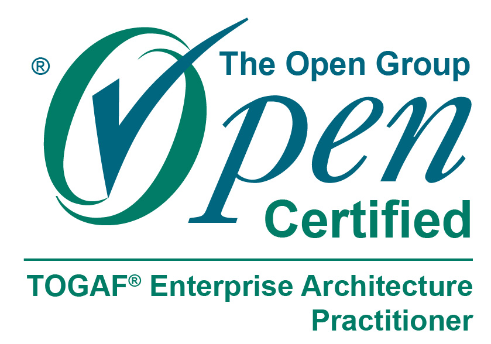
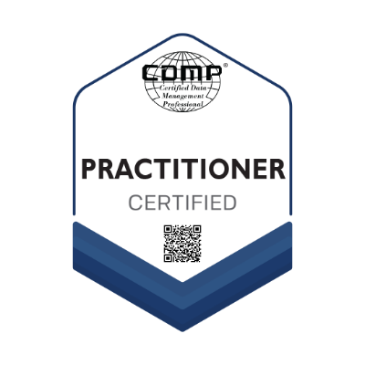
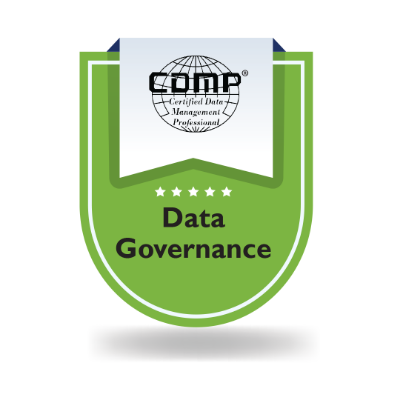
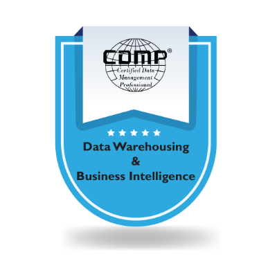
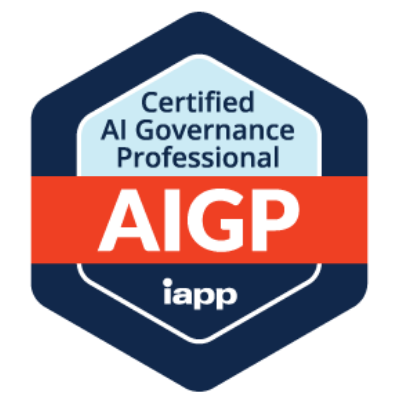
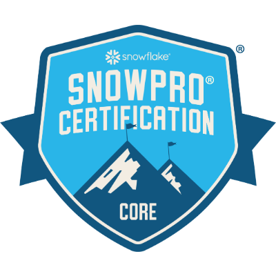

# Hi, I'm Aniket Dwivedi 👋

### Data Engineering Architect 🛠️ — I build the layer under the dashboard

**Lakehouse · Data Vault 2.0 · PySpark & SQL at scale · Governed by design**

*and BI & Analytics at enterprise scale — 5× Tableau certified, 500+ workbook estates*

Solutions Architect, Chief Data Office · Pune, India

  
  
  

---

## 🚀 About Me

**I started out building dashboards.** Somewhere around the fiftieth *"can you just
add a filter?"*, I noticed the pattern: the dashboard was almost never the problem.
Two reports disagreed because two systems defined *active customer* differently.
A supplier's spend looked halved because the same vendor existed twice under
slightly different keys. A number couldn't be defended because nobody could say
where it came from. So I kept moving one layer down.

**Down into the pipelines first.** SQL and PL/SQL, then Python and PySpark; ETL and
ELT over Oracle, Teradata, Snowflake and Databricks; watermarks, incremental loads
and the unglamorous discipline of making a job safe to re-run at 3am. A report is
only ever as good as the load that fed it.

**Then into the models.** Dimensional first, then Data Vault — because a warehouse
serving eight source systems needs somewhere for their disagreements to *live*
rather than be averaged away. Then into architecture proper, and TOGAF, because
the design that survives contact with an organisation is the one that fits a
target state somebody actually signed.

**Then into governance, which turned out to be the layer I'd been circling all
along.** A glossary term with a named owner. A data-quality rule with the teeth to
stop a load. Lineage you can put in front of an auditor. This is the machinery
that makes a number *mean* something — and it's why DAMA CDMP, Collibra and Chief
Data Office operating models are how I spend my time now.

**Today I work as a data engineering architect** — designing and building the
foundation itself: ingestion and pipeline design, the canonical and Data Vault
models underneath, the lakehouse they land in, and the governance that makes any
of it defensible. On top of that I still build the BI and analytics layer,
because knowing exactly what a dashboard will ask of a model is what stops you
designing one it cannot answer. Increasingly the consumer is an agent rather
than a person, and an agent answering questions about enterprise data is exactly
as trustworthy as the certified datasets, entitlements and lineage underneath it.
That work has run through Chief Data Office, Credit Risk & Regulatory Reporting,
Procurement & Supply Chain, Merchandising & Customer Analytics, Risk Analytics
and Data & Analytics Centre of Excellence functions.

Fifteen years in, the through-line hasn't changed: **make the number defensible,
then make it easy.** Everything in the repositories below is that belief in
runnable form.

> **Primary — Data Engineering & Architecture.** Python · PySpark · SQL/PL-SQL ·
> Databricks · Snowflake · Microsoft Fabric · Starburst/Trino · ETL/ELT · Data Vault 2.0 ·
> dimensional modelling · lakehouse · TOGAF · DAMA CDMP · Collibra · data quality ·
> lineage · MDM
>
> **Secondary — BI & Analytics.** 5× Tableau certified · Tableau Server/Cloud
> architecture · 500+ workbook estates · RLS and certified data sources · Power BI ·
> Tableau Pulse · plus agentic AI on governed data (Agentforce · Data 360 · IAPP AIGP)

## 📂 What I've Published

Open-source reference implementations of the patterns above, ordered the way I'd
want them read — engineering and architecture first, BI last. **Everything here
was executed before it was published**: the pipelines run, the tests pass, and the
numbers in each README came from a real run rather than an estimate.

| Repository | What it is | Proof |
|---|---|---|
| **[trade-to-report](https://github.com/aniketdwivedi7388/trade-to-report)** | A domain data architecture for banking, worked end to end. One canonical model read by a finance lens and a risk lens that produce **four different numbers for the same derivatives book** — with a published reconciliation, lineage captured by the loaders themselves, and 42 data standards, ten of them enforced by a linter that fails the build. | 60 tests · linter has negative tests |
| **[sap-data-vault-2](https://github.com/aniketdwivedi7388/sap-data-vault-2)** | Data Vault 2.0 over real SAP procurement tables (LFA1, EKKO, EKPO, EKBE, MARA). Four source systems, hubs / links / multi-source satellites, hash keys & diffs, PIT + bridge, business vault, star marts. | Runs in 60s on DuckDB · 32 tests |
| **[lakehouse-pipeline-patterns](https://github.com/aniketdwivedi7388/lakehouse-pipeline-patterns)** | PySpark medallion architecture — incremental ingestion with watermarks, SCD Type 2, a declarative data-quality engine, as-of dimensional joins. | Runs on a laptop, no cluster · 23 tests |
| **[pyspark-rdd-internals](https://github.com/aniketdwivedi7388/pyspark-rdd-internals)** | What actually happens on the cluster: map-side combine, shuffle bytes, partitioning, caching, skew — each **measured**, then shown as the DataFrame/SQL equivalent you should ship. | 28 tests · real measurements |
| **[pydb-connect](https://github.com/aniketdwivedi7388/pydb-connect)** | Config-driven connectivity across MySQL, Postgres, Oracle, Snowflake, SQLite and ADLS. Secrets never in the repo, connections that always close, bulk loads that batch, retries that classify errors. | 172 tests · imports with zero drivers |
| **[data-governance-toolkit](https://github.com/aniketdwivedi7388/data-governance-toolkit)** | The working artefacts of a governance function — glossary templates, a 61-rule DQ catalogue with a runnable YAML-driven engine, stewardship operating model, RACIs, CDO KPI framework, lineage guide. | DAMA-DMBOK aligned · runnable gate |
| **[governed-ai-grounding](https://github.com/aniketdwivedi7388/governed-ai-grounding)** | Grounding enterprise AI agents in governed data — reference architecture, semantic layer as metric contract, guardrail patterns, AI controls mapping, evaluation harness. | Runnable eval harness, CI-ready |
| **[tableau-architecture-playbook](https://github.com/aniketdwivedi7388/tableau-architecture-playbook)** | Enterprise Tableau at scale — certified data sources, RLS patterns, performance tuning, content rationalisation, Server→Cloud migration runbooks, estate-audit / Hyper API / TabPy scripts. | Read-only audit tooling included |

Three of these reproduce failure modes I have actually hit and fixed — a future-dated
row poisoning a watermark so a job silently ingests nothing forever; SAP purchase-order
numbers colliding across instances because they are not globally unique; a quality suite
reporting 100% pass on broken data because `NULL > 0` is `NULL`, not `false`.
Reproducing a bug is worth more than describing one.

## 🛠️ Tech Stack

**Data Engineering & Pipelines**

  
  
  
  
  
  
  
  
  
  
  

**Data Platforms, Lakehouse & Cloud**

  
  
  
  
  
  
  
  
  
  
  
  
  

**BI & Analytics**

  
  
  
  
  
  
  

**Governance, Salesforce & Delivery**

  
  
  
  
  
  
  
  

## 🏆 Certifications

  
  
  
  
  
  
  
  

  
  
  
  
  
  
  

| Area | Credentials |
|---|---|
| 🔧 **Data Engineering** | **Databricks Certified Data Engineer Professional** · **Snowflake SnowPro Core** · Microsoft **[Fabric Analytics Engineer Associate](https://learn.microsoft.com/en-us/users/aniketdwivedi-5142/credentials)** (DP-600) |
| ☁️ **Salesforce — 5× Tableau certified** | **Tableau Architect** · **Tableau Data Analyst** · Tableau Desktop Specialist · **Agentforce Specialist** · **Data 360 Consultant** · **CRM Analytics & Einstein Discovery Consultant** |
| 🛡️ **Data Management** | **DAMA CDMP Practitioner** — specialisations in Data Governance & Stewardship (DGSP) and Data Warehousing & BI · **IAPP AIGP** (AI Governance Professional) |
| 🏗️ **Architecture & Cloud** | **TOGAF Enterprise Architecture Practitioner** (The Open Group) · Google Cloud |
| 🔄 **Agile & Analysis** | Certified **SAFe Agilist** (AI-Empowered) · **BCS Certified Business Analyst** |

## 🏢 Domains

Data platforms are only as good as the domain understanding behind them. Where
I have delivered:

| Domain | Depth |
|---|---|
| **Asset & Investment Management** | Chief Data Office reporting, AUM and net-flow metrics, mandate and benchmark data, investment-risk and controls reporting, regulatory (FED) submissions |
| **Banking & Credit Risk** | Credit-card and corporate credit-risk estates — exposure, delinquency, vintage, loss forecasting and portfolio-risk reporting on governed warehouse foundations |
| **Procurement & Supply Chain** | Purchase-to-pay and SAP procurement data (purchase orders, goods receipts, vendor master, info records), inventory, logistics, vendor performance and on-time-delivery analytics |
| **Retail & Omnichannel** | Market-basket analysis, cross-sell and loyalty segmentation, competitor price-index tracking for dynamic pricing, store-traffic prediction |
| **Insurance** | Policy and claims analytics, predictive risk modelling |
| **Energy & Telecom** | Power-distribution and smart-meter style operational data, network and customer-experience reporting |

## 📌 Signature Projects

### Data Engineering & Architecture

**🏛️ "House of Data" — Governed Data Foundation + Agentic AI** · *Chief Data Office* 
Engineered the Chief Data Office's single-source data foundation — ingestion, harmonisation and modelling across **Snowflake, Azure & Microsoft Fabric**, federated through **Starburst/Trino**, governed in **Collibra** — then built agentic-AI experiences on **Agentforce, Prompt Builder & Data 360** so leadership can ask natural-language questions on governance, quality and lineage, feeding senior risk dashboards and regulatory (FED) reporting.

**📦 Data-as-a-Service at Scale** · *Data & Analytics Centre of Excellence* 
Owned the full pipeline — data marts, dimensional models, **ETL with Tableau Prep · Alteryx · Oracle SQL · Python** (incl. Scrapy web-scraping of alternative data) — deploying **150+ governed dashboards globally**; embedded MDM & anomaly monitoring that helped identify **$20M in supply-chain savings**.

**🏦 Credit-Risk Data & Analytics — Consumer & Corporate Banking** · *Credit Risk & Regulatory Reporting* 
Built governed data foundations on **Snowflake** with enterprise **ETL/ELT pipelines (Python — pandas/NumPy, Alteryx)** over Oracle & Big Data back ends, powering exposure, delinquency, vintage and portfolio-risk reporting for credit-card operations with audited source-to-target lineage.

### BI & Analytics

**🚢 COVID-19 Live Global Ports & Shipping-Routes Command Center** · *Procurement & Supply Chain* 
**Python + REST-API ingestion pipelines** feeding a live Tableau dashboard with real-time status of countries, borders and ports — best/most-affordable route recommendations across Sea, Air & Land with live climate-warning overlays. The procurement team's daily command center as global supply lines changed by the hour.

**🛒 Omnichannel Retail Analytics** · *Merchandising & Customer Analytics* 
Market-basket analysis, cross-sell/upsell recommendations, loyalty segmentation, **Python-based competitor price-index pipelines** for dynamic pricing, and store-traffic prediction on Teradata-backed data.

## 💼 How I Got Here

Fifteen years, one direction of travel — each step a layer further down the stack,
then a layer further out in scope.

| Stage | Role | Function | What changed |
|---|---|---|---|
| **Reporting** | Data Analyst · Tableau Trainer | Business Intelligence | Learned the tool, and that the tool is rarely the problem |
| **Analytics** | Business Analyst · Tableau Consultant | Merchandising & Customer Analytics | Retail and CX analytics — market basket, loyalty, pricing, store traffic |
| **Modelling** | Senior Data Analyst · Consultant | Risk Analytics | Insurance analytics and predictive risk models; started owning the data, not just the view |
| **Engineering** | Senior Data Engineer · BI Solution Architect | Procurement & Supply Chain | Supply-chain data platform and Data-as-a-Service; 150+ governed dashboards, MDM and anomaly monitoring |
| **Programme delivery** | Senior Process Manager · Lead Data Consultant | Data & Analytics Centre of Excellence | Multi-stakeholder BI programmes; legacy-BI to Tableau migration and rationalisation |
| **Architecture** | Design Architect · Product Manager | Credit Risk & Regulatory Reporting | Credit-risk reporting estates, enterprise architecture and data modelling as the deliverable |
| **Chief Data Office** | Solutions Architect | Chief Data Office | Governed data foundations, data-vault and lakehouse architecture, agentic AI on certified data, regulatory reporting |

*Roles are described by the function they sat in rather than by employer —
the work is the same wherever the letterhead came from. Happy to talk
specifics in a conversation.*

## 🎯 Current Focus

**Primary — data engineering architecture**

- ⚡ **Pipelines & platform** — lakehouse pipelines with **Databricks & PySpark** (certified Data Engineer Professional), Microsoft Fabric/OneLake, Snowflake, Starburst/Trino federation; incremental loads and jobs that are safe to re-run
- 🏗️ **Modelling & target state** — Data Vault 2.0 for multi-source landscapes, canonical domain models, TOGAF-driven target-state design, conformed dimensions and governed semantic layers at CDO scale
- 🛡️ **Governance in the pipeline, not beside it** — data quality with the teeth to stop a load, lineage captured as data, policy conformance that fails a build

**Secondary — BI & analytics on top of it**

- 📊 **BI at scale** — Tableau Server/Cloud architecture, certified data sources, row-level security, estate rationalisation; Power BI
- 🤖 **Agentic analytics** — Agentforce agents grounded in governed data, Tableau Pulse proactive insights, and extending DAMA-style controls to AI pipelines (IAPP AIGP)

## 🤝 Let's Talk

Always happy to compare notes with people working on the same problems. Particularly
interested in conversations about:

- **Data engineering architecture** — Data Engineering Architect, Data Architect, Principal / Lead Data Engineer, Data Platform Lead
- **Lakehouse and warehouse design** — Data Vault 2.0, canonical domain models, migration off legacy estates
- **Chief Data Office and governance transformation** — operating models, DAMA-aligned frameworks, Collibra adoption
- **Enterprise BI at scale** — Tableau architecture, migration and rationalisation
- **Agentic AI on governed data** — and where the governance actually has to sit

Open to consulting, advisory and speaking on any of the above.

📫 **[LinkedIn](https://www.linkedin.com/in/dwivedianiket/)** · **[aniketdwivedi.com](https://www.aniketdwivedi.com)** · **[aniket.dwivedi@icloud.com](mailto:aniket.dwivedi@icloud.com)**

## 📈 By the Numbers

  
  
  
  

<i>The tests live in the repositories, not in that badge — clone any of them and run <code>pytest</code>.</i>

<!--
  GitHub stats cards. Enabled here for later: github-readme-stats runs on a
  shared free Vercel instance that is frequently rate-limited by the GitHub API,
  and a card that fails renders as a broken image on the profile. Uncomment once
  you are happy to rely on it (or self-host the service on your own Vercel).

  

    
    
  

-->

---

💬 *Everything in the repositories above is runnable. Clone it, run it, tell me where I'm wrong.*

